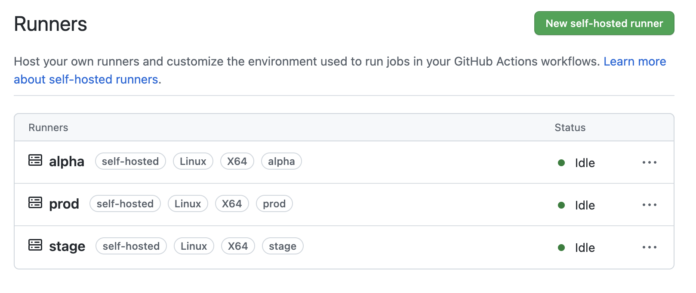

# test-github-workflows

This is easy and flexible GitHub workflow example with CI/CD scheme stage/alpha/production. In this example we run GitHub runners and trigger deploy jobs by pull requests

## 1. Build runners

Go to **Settings > Actions > Runners**

Click **"New self-hosted runner"** button

Go to terminal. Add **stage**, **alpha** and **prod** runners use config tokens below

Replace **{password}** and **{token}** arguments in code below. Every runner must have personal token

Don't forget change my repository link in Dockerfile: https://github.com/CaptainOmega/test-github-workflows

Build **stage** image
```
docker build --no-cache --platform linux/amd64 --build-arg deploy_user_password={password} --build-arg runner_name=stage --build-arg runner_token={token} -t ubuntu-stage-server:1.0.0 .
```

Build **alpha** image
```
docker build --no-cache --platform linux/amd64 --build-arg deploy_user_password={password} --build-arg runner_name=prod --build-arg runner_token={token} -t ubuntu-alpha-server:1.0.0 .
```

Build **prod** image
```
docker build --no-cache --platform linux/amd64 --build-arg deploy_user_password={password} --build-arg runner_name=prod --build-arg runner_token={token} -t ubuntu-prod-server:1.0.0 .
```

## 2. Start runners
Install [Docker Compose](https://docs.docker.com/compose/install/)

And then run command
```
docker-compose up
```

After that runners must be registered


## 3. Add environments
Go to **Settings > Environments**. Here we need create stage/alpha/prod environments. Click **"New environment"** button

Here we need types three secrets for Docker registry:
- CI_REGISTRY
- CI_REGISTRY_PASSWORD
- CI_REGISTRY_USER


After this manipulations we must get this


## 4. Add branch rules
We need create branch alpha in GitHub repository

Here i'am use base branches for deployment:
- **master** (for production deploy)
- **alpha** (for demo deploy)

So we need add branch rules in **Settings > Branches**

Click **"Add rule"** button

And here we create protected master and alpha rules with same parameters. Check option **"Require a pull request before merging"** and **"Require status checks to pass before merging"**


After this actions it must looks like this:


## 5. Make pull requests
Now we can make pull request in our base branches (**master/alpha**), that start building in stage runner, deploy to stage machine and call test checking


After worflow successfully finished we can merge pull request, this trigger **prod/alpha** deploy jobs


In this example i'am use fake job steps like:
```
echo "docker login --username ${{ secrets.CI_REGISTRY_USER }} --password ${{ secrets.CI_REGISTRY_PASSWORD }}"
```
This is just example, if we want use Docker registry in our build, it must be like that:
```
docker login --username ${{ secrets.CI_REGISTRY_USER }} --password ${{ secrets.CI_REGISTRY_PASSWORD }}
```

## Result
In conclusion we get easy and comfortable workflow that allow build Docker image, run tests and make stage/alpha/production deploy. We can combine workflow with Docker Hub and other tools